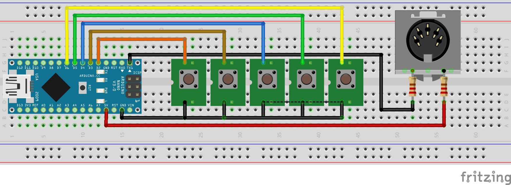

# 🎛️ Transport – Arduino MIDI Transport Controller

**Author:** Damizon  
**Improved by:** Damizon  
**Platform:** Arduino Nano  
**Tested with:** FL Studio 12  
**License:** MIT

---

## 🎯 What is it?

**Transport** is a simple Arduino-based MIDI transport controller designed to work with FL Studio (Fruity Loops).  
It uses 5 buttons to send MIDI SysEx messages that control the DAW’s basic playback functions:

- ▶️ Play  
- ⏹️ Stop  
- ⏮️ Rewind  
- ⏭️ Forward  
- 🔴 Record

---

## 🧰 Required Components

- Arduino Nano (or compatible)
- 5x momentary push buttons
- Resistors: 220Ω (for MIDI output)
- MIDI DIN connector
- Basic wires and breadboard or PCB

---

## 🔌 Wiring

| Pin | Function     |
|-----|--------------|
| D2  | Play         |
| D3  | Stop         |
| D4  | Rewind       |
| D5  | Forward      |
| D6  | Record       |
| TX  | MIDI OUT via 220Ω resistor |
| +5V | MIDI OUT via 220Ω resistor |
| GND | Common ground for all buttons and MIDI |

> ⚠️ Note: Use TX and +5V through 220Ω resistors for proper MIDI voltage levels.

---

## 💾 Usage

1. Open `sysex.ino` in Arduino IDE.
2. Select your board (e.g., Arduino Nano) and COM port.
3. Upload the sketch to the board.
4. Connect MIDI OUT to your PC (via USB-MIDI interface or real DIN).
5. Open FL Studio and map SysEx MIDI messages to transport functions.

---

## 🧪 Tested With

- Arduino Nano (CH340)
- FL Studio 12
- USB-MIDI interface
- MIDI-OX (for debugging messages)

---

## 🖼️ Schematic Preview

---

## 📄 License

MIT License — Free to use, modify and distribute.

---

## 🙌 Credits

Created by **Damizon**  
Documented and improved by **Damizon**

> ENJOI! 🎶
